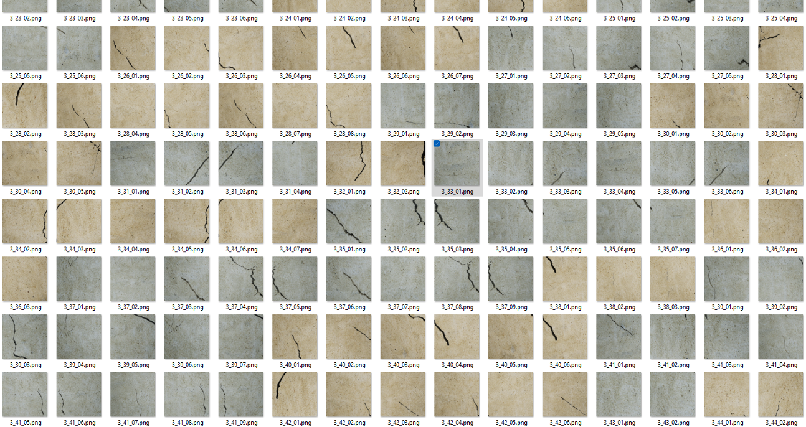
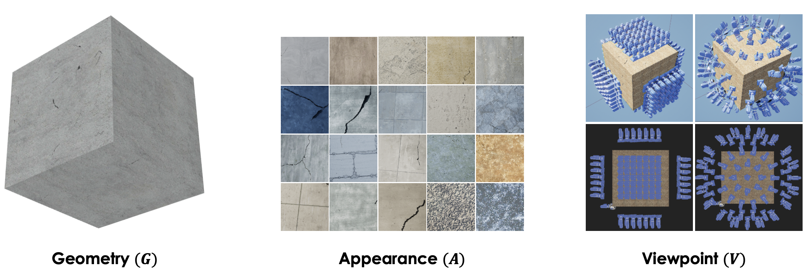
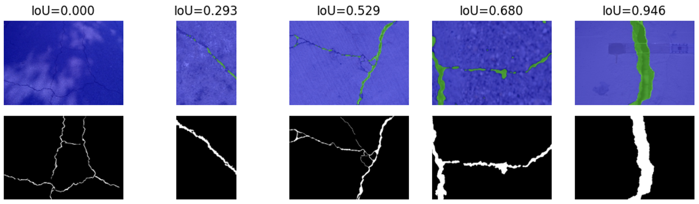

# Requirements for Parametric Design of Physics-based Synthetic Data Generation for Learning and Inference of Defect Conditions
The paper is presented in [the CRC 2024 conference @ Des Moines, Iowa.](#citation)



## Dataset

* Download our synthetic crack dataset [here](https://drive.google.com/drive/folders/1wc5jiEJ1cVaDnWYtZxB0zPIdWyUE-7Hv?usp=sharing)

    This is the generated synthetic crack images used in the training experiments. Note that there are different sets of crack images using different strategies for placing cameras (dome vs. grid). Unzip any of them, you will find the data folder with a structure as shown:
    ```
    |--- dataset_dome
       |--- image
          |--- 1_1_01.png
          |--- 1_1_02.png
          |--- ...
       |--- mask
          |--- 1_1_01.png
          |--- 1_1_02.png
          |--- ...
    ```

    The mask images represent the background and crack as the color black and white, respectively. The files are named as `{model_id}_{material_id}_{crop_id}.png`.

* Other publicly available real crack images used for validation are listed:
    * [CrackForest (Shi et al. 2016)](https://github.com/cuilimeng/CrackForest-dataset/tree/master)
    * [Crack500 (Yang et al. 2019)](https://www.kaggle.com/datasets/pauldavid22/crack50020220509t090436z001)
    * [DeepCrack (Liu et al. 2019)](https://github.com/yhlleo/DeepCrack)
    * [CrackSeg9k (Kulkarni et al. 2022)](https://dataverse.harvard.edu/dataset.xhtml?persistentId=doi:10.7910/DVN/EGIEBY)



## Model training and evaluation

The training codes originate from the Hugging Face [tutorial](https://huggingface.co/docs/transformers/en/tasks/semantic_segmentation) for SegFormer. Refer to the link for more detailed descriptions and any required installations. We simply provide two scripts for training and inference. Note that the Hugging Face pipeline for segmentation takes the class label maps, so you would need to first convert the above masks into 0 and 1 to run the codes.

```
python segformer_train.py {training_dir} {validation_dir}
python segformer_inference.py {checkpoint_path} {pred_visualizations_output_dir} {test_img_dir}
```


## Citation
If you find our dataset, code, or paper useful, please cite
```bibtex
@inproceedings{
  hsu2024requirements,
  titl      = {Requirements for Parametric Design of Physics-Based Synthetic Data Generation for Learning and Inference of Defect Conditions},
  author    = {Hsu, Shun-Hsiang and Golparvar-Fard, Mani},
  booktitle = {Construction Research Congress 2024},
  pages     = {436--445}
}
```